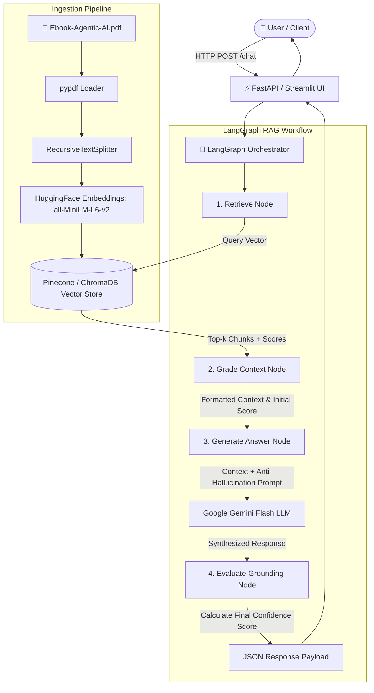

# 🤖 RAG-based Agentic AI Chatbot

A production-grade Retrieval-Augmented Generation (RAG) chatbot in Python powered by **LangGraph**, **Google Gemini Flash LLM**, **HuggingFace Embeddings**, and **Pinecone** (with local **ChromaDB** fallback). 

The chatbot answers user queries strictly grounded in the **[Agentic AI eBook](https://konverge.ai/pdf/Ebook-Agentic-AI.pdf)** knowledge base, with built-in anti-hallucination guardrails, confidence scoring, and expandable source chunk citations.

---

## 🌟 Key Features

- **Strict Grounding & Anti-Hallucination Guardrails**: Powered by a custom anti-hallucination system prompt and LangGraph evaluation state machine to ensure zero hallucinated responses.
- **HuggingFace Embeddings**: Uses `sentence-transformers/all-MiniLM-L6-v2` (384-dimensional dense vectors) for fast, zero-API-cost semantic embedding generation.
- **Google Gemini Flash LLM**: Leverages Google Gemini (`gemini-1.5-flash` / `gemini-2.0-flash`) for concise, fact-based synthesis.
- **Dual Vector Store Architecture**:
  - **Pinecone**: Cloud vector database when `PINECONE_API_KEY` is provided.
  - **ChromaDB**: Out-of-the-box local persistent vector database fallback.
- **LangGraph Workflow Orchestration**: Stateful DAG execution pipeline (`Retrieve` ➔ `Grade Context` ➔ `Generate Answer` ➔ `Evaluate Grounding`).
- **Full Deliverable Interfaces**:
  - **FastAPI Chat API**: RESTful endpoints returning `final_answer`, `retrieved_context_chunks`, and `confidence_score`.
  - **Streamlit Web UI**: Glassmorphism dark-mode UI with confidence gauges, sample query presets, and expandable page context inspector.

---

## 🏗️ Architecture Explanation



### LangGraph Workflow Nodes:
1. **Retrieve Node**: Queries vector store using HuggingFace query embeddings for top-k contextual chunks.
2. **Grade Context Node**: Evaluates document relevancy scores and constructs formatted context blocks with page metadata.
3. **Generate Answer Node**: Synthesizes final answer using Google Gemini Flash and strict grounding instructions.
4. **Evaluate Grounding Node**: Verifies answer factual grounding, detecting fallback condition ("insufficient information") and calculating final confidence score (0.0 - 1.0).

---

## 🛡️ Anti-Hallucination System Prompt

```text
You are an expert AI assistant strictly grounded in the 'Agentic AI eBook' knowledge base.

CRITICAL INSTRUCTIONS:
1. Answer the user's question STRICTLY using ONLY the provided Context Chunks below.
2. Do NOT use any external knowledge, outside assumptions, or extrapolation beyond what is explicitly stated in the context.
3. If the context does NOT contain enough information to fully answer the question, state clearly:
   "Based on the provided Agentic AI eBook context, there is insufficient information to answer this question."
4. Always maintain high factual accuracy and cite exact page numbers when referencing facts from the context.
5. Do NOT hallucinate or make up any details under any circumstances.
```

---

## 🚀 Getting Started

### 1. Prerequisites
- Python 3.10+
- (Optional) [Google Gemini API Key](https://aistudio.google.com/)
- (Optional) [Pinecone API Key](https://app.pinecone.io/)

### 2. Installation

Clone the repository and install Python dependencies:

```bash
git clone https://github.com/your-username/ragchatbot.git
cd ragchatbot

# Create and activate virtual environment
python -m venv venv
# On Windows:
venv\Scripts\activate
# On Linux/macOS:
source venv/bin/activate

# Install dependencies
pip install -r requirements.txt
```

### 3. Environment Configuration

Copy `.env.example` to `.env` and fill in your API keys:

```bash
cp .env.example .env
```

`.env` setup:
```env
GOOGLE_API_KEY=your_google_gemini_api_key_here
GEMINI_MODEL=gemini-1.5-flash
EMBEDDING_MODEL_NAME=sentence-transformers/all-MiniLM-L6-v2

# Set to 'pinecone' or 'chroma' (or 'auto')
VECTOR_DB_TYPE=auto
PINECONE_API_KEY=your_pinecone_api_key_here
PINECONE_INDEX_NAME=agentic-ai-rag
```

> **Note**: If `PINECONE_API_KEY` is omitted, the application automatically uses local persistent **ChromaDB**. If `GOOGLE_API_KEY` is omitted, the chatbot runs in deterministic local context summary mode.

---

## 📥 PDF Data Ingestion

Run the ingestion script to download `https://konverge.ai/pdf/Ebook-Agentic-AI.pdf`, extract text page-by-page, generate HuggingFace embeddings, and index into the Vector Database:

```bash
python ingest.py
```

---

## 💻 Running the Application

### Option A: Launch Streamlit Web UI

```bash
streamlit run ui.py
```
Open your browser at `http://localhost:8501`.

### Option B: Launch FastAPI Backend Server

```bash
uvicorn api:app --reload --port 8000
```
- Interactive Swagger API Documentation: `http://localhost:8000/docs`
- Health check: `http://localhost:8000/`

---

## 📋 Sample Queries & Verification

The project includes 6 sample test queries grounded in the eBook:

1. **"What is Agentic AI according to the ebook?"**
   - *Expected Context*: Page 3-5 overview of autonomous decision-making systems.
2. **"What are the main components of an Anatomy of an Agentic AI System?"**
   - *Expected Context*: Chapter 02 breakdown of perception, decision, tool use, and memory modules.
3. **"How do Multi-Agent Systems orchestrate decision making?"**
   - *Expected Context*: Chapter 03 & 04 multi-agent framework coordination.
4. **"What is the difference between traditional automation and Agentic AI?"**
   - *Expected Context*: Autonomous reasoning vs static rule-based script execution.
5. **"What factors determine an organization's readiness for Agentic AI?"**
   - *Expected Context*: Chapter 05 organizational readiness metrics and infrastructure requirements.
6. **"What is the capital of France?"** *(Out-of-Scope Anti-Hallucination Test)*
   - *Expected Output*: "Based on the provided Agentic AI eBook context, there is insufficient information to answer this question." (Confidence Score: 0.0)

---

## 📡 API Reference

### `POST /chat`

#### Request Body:
```json
{
  "query": "What is Agentic AI according to the book?"
}
```

#### Response Body:
```json
{
  "query": "What is Agentic AI according to the book?",
  "final_answer": "Agentic AI refers to artificial intelligence systems capable of autonomous decision-making...",
  "retrieved_context_chunks": [
    {
      "text": "Agentic AI provides a practical framework for leveraging these systems...",
      "score": 0.8954,
      "metadata": {
        "page_number": 4,
        "source": "Ebook-Agentic-AI.pdf",
        "chunk_id": "page_4_chunk_1"
      }
    }
  ],
  "confidence_score": 0.8954
}
```

---

## 🧪 Running Automated Tests

Run the test suite using `pytest`:

```bash
pytest tests/test_rag.py -v
```

---

## 📁 Repository Structure

```
ragchatbot/
├── .env.example          # Template for environment variables
├── .gitignore            # Git ignore rules
├── README.md             # Project documentation & guide
├── requirements.txt      # Python dependencies
├── config.py             # Configuration management
├── embeddings.py         # HuggingFace Embeddings module
├── vector_store.py       # Pinecone & ChromaDB Vector Store manager
├── ingest.py             # PDF download, extraction, chunking & vector indexing
├── rag_graph.py          # LangGraph state machine & RAG execution workflow
├── api.py                # FastAPI server endpoints
├── ui.py                 # Streamlit web application
└── tests/
    └── test_rag.py       # Automated unit & integration tests
```

---

## 📜 License & Acknowledgements

Created for the RAG AI Chatbot Assignment. Data sourced from [Konverge AI Agentic AI eBook](https://konverge.ai/pdf/Ebook-Agentic-AI.pdf).
