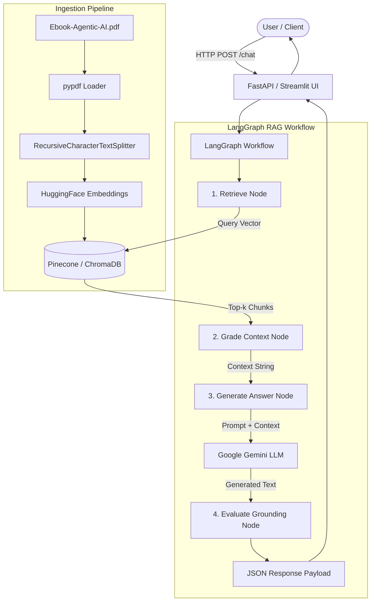

# RAG Agentic AI Chatbot

A Retrieval-Augmented Generation (RAG) chatbot in Python built with **LangGraph**, **Google Gemini Flash LLM**, **HuggingFace Embeddings**, **Pinecone**, **ChromaDB**, **FastAPI**, and **Streamlit**.

The chatbot answers questions strictly based on the [Agentic AI eBook](https://konverge.ai/pdf/Ebook-Agentic-AI.pdf) knowledge base.

---

## Features

- **Strict Document Grounding**: Custom system prompt and LangGraph evaluation state graph to prevent hallucinations.
- **HuggingFace Embeddings**: Uses `sentence-transformers/all-MiniLM-L6-v2` (384 dimensions) for local vector embeddings.
- **Google Gemini Flash LLM**: Synthesizes structured answers strictly grounded in retrieved PDF context chunks.
- **Dual Vector Store Support**: Supports **Pinecone** vector database with local **ChromaDB** fallback.
- **LangGraph State Graph**: Workflow pipeline (`Retrieve` -> `Grade Context` -> `Generate Answer` -> `Evaluate Grounding`).
- **Web UI & API**:
  - **FastAPI**: REST endpoints for `/chat`, `/ingest`, `/health`, and `/sample-queries`.
  - **Streamlit**: Conversational chat UI with message history, page citations, and context expanders.

---

## Architecture Diagram



### LangGraph Workflow Nodes:
1. **Retrieve Node**: Queries vector store using HuggingFace query embeddings for top-k contextual chunks.
2. **Grade Context Node**: Constructs formatted context blocks with page metadata.
3. **Generate Answer Node**: Synthesizes response using Google Gemini Flash and strict grounding instructions.
4. **Evaluate Grounding Node**: Evaluates answer grounding and final confidence score (1.0 for grounded answers, 0.0 for unsupported queries).

---

## System Prompt

```text
Answer the question based only on the provided context chunks from the Agentic AI eBook.

Guidelines:
- Rely strictly on facts present in the context. Do not extrapolate or assume outside information.
- If the context does not contain enough information to answer the question, state:
  "Based on the provided Agentic AI eBook context, there is insufficient information to answer this question."
- Organize the response clearly with an Overview, Detailed Insights, and page citations.

Context:
{context}

Question: {question}
```

---

## Setup Instructions

### 1. Prerequisites
- Python 3.10+
- (Optional) [Google Gemini API Key](https://aistudio.google.com/)
- (Optional) [Pinecone API Key](https://app.pinecone.io/)

### 2. Installation

Clone the repository and install dependencies:

```bash
git clone https://github.com/Nandunandu24/RagChatBot.git
cd RagChatBot

python -m venv venv
# Windows:
venv\Scripts\activate
# Linux/macOS:
source venv/bin/activate

pip install -r requirements.txt
```

### 3. Environment Setup

Copy `.env.example` to `.env` and add your configuration:

```bash
cp .env.example .env
```

Example `.env`:
```env
GOOGLE_API_KEY=your_google_gemini_api_key
GEMINI_MODEL=gemini-1.5-flash
EMBEDDING_MODEL_NAME=sentence-transformers/all-MiniLM-L6-v2

VECTOR_DB_TYPE=auto
PINECONE_API_KEY=your_pinecone_api_key
PINECONE_INDEX_NAME=agentic-ai-rag
TOP_K_RETRIEVAL=6
```

---

## Ingestion & Data Setup

Download and process the eBook PDF:

```bash
python ingest.py
```

---

## Running the Application

### Streamlit Chat UI
```bash
streamlit run ui.py
```
Open `http://localhost:8501`.

### FastAPI Backend Server
```bash
uvicorn api:app --reload --port 8000
```
API Swagger docs available at `http://localhost:8000/docs`.

---

## Sample Evaluation Queries

1. `"What is Agentic AI according to the ebook?"`
2. `"What are the types of agents based on functional versatility?"`
3. `"What are the main components of an Anatomy of an Agentic AI System?"`
4. `"How do Multi-Agent Systems orchestrate decision making?"`
5. `"What is the difference between traditional automation and Agentic AI?"`
6. `"What factors determine an organization's readiness for Agentic AI?"`
7. `"What is the capital of France?"` *(Anti-hallucination refusal test)*

---

## Automated Tests

Run the test suite with pytest:

```bash
pytest tests/test_rag.py -v
```

---

## Project Structure

```
RagChatBot/
├── .env.example          # Environment variable template
├── .gitignore            # Git ignore configuration
├── README.md             # Project documentation
├── requirements.txt      # Python dependencies
├── config.py             # App configuration settings
├── embeddings.py         # HuggingFace embedding module
├── vector_store.py       # Pinecone and ChromaDB store manager
├── ingest.py             # PDF download, text extraction, chunking, indexing
├── rag_graph.py          # LangGraph state machine implementation
├── api.py                # FastAPI endpoints
├── ui.py                 # Streamlit chat interface
└── tests/
    └── test_rag.py       # Pytest suite
```
